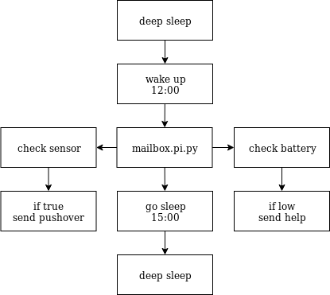

# mailbox
Get notification from your mailbox, when there is mail

**mailbox.pi.py (Test code for pi zero)**
* Connect door sensor to pin 14 & GND
* pip install python-pushover
* sudo cp mailbox.service /usr/systemd/system
* sudo systemctl enable mailbox
* sudo systemctl start mailbox
* sudo systemctl status mailbox

**TODO**
- [ ] Convert to MicroPython for WEMOS D1 Mini
- [ ] Add Deep Sleep for Wemos D1 Mini (20 hours Off, 4 Hours On)
- [ ] Monitor Battery and Send notication when low

**Parts List**
* WEMOS D1 Mini
* WEMOS Battery Shield for D1 Mini
* 1200mAh Battery
* Door Sensor

**Resources**
* https://arduinodiy.wordpress.com/2016/12/25/monitoring-lipo-battery-voltage-with-wemos-d1-minibattery-shield-and-thingspeak/
* https://ezcontents.org/wemos-d1-mini-temperature-server
* https://forum.hobbycomponents.com/viewtopic.php?f=111&t=2133
* https://www.afternerd.com/blog/how-to-send-an-email-using-python-and-smtplib/
